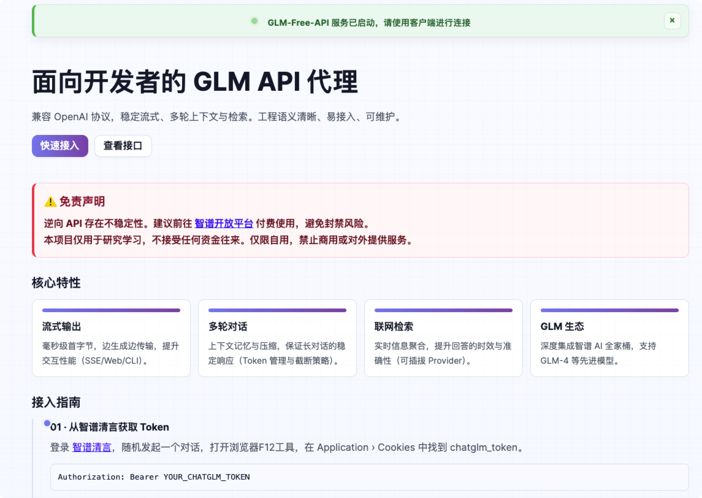
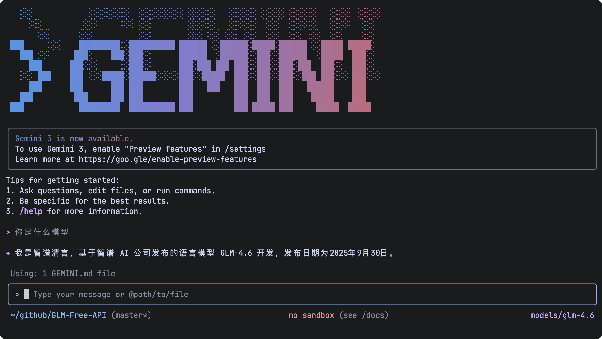
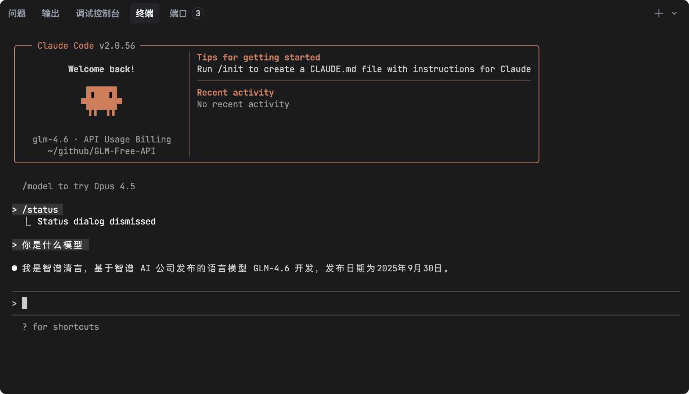

# GLM AI Free Service

## Project Description

<span>[ <a href="README.md">中文</a> | English ]</span>

Supports GLM-4-Plus high-speed streaming output, multi-round conversations, agent conversations, contemplative models, Zero thinking reasoning models, video generation, AI drawing, web search, long document interpretation, image parsing, zero-configuration deployment, multi-token support, and automatic session trace cleanup.

This project is modified from [https://github.com/LLM-Red-Team/glm-free-api](https://github.com/LLM-Red-Team/glm-free-api), thanks to the original contributor!
Important note: The original project contained malicious code due to a supply chain attack. It is strongly recommended not to continue using it.

Reasons for modification:
1. The original project author's account was banned and can no longer be updated
2. Malicious code from the original project has been removed. Source code review is welcome

## Update Notes

1. Updated models.ts model list to support the latest models: glm-4.5, glm-4.5-x, glm-4.5-air, glm-4.6

2. Repackaged new version of Docker image: `akashrajpuroh1t/glm-free-api-fix:latest`

3. Fixed malicious code issues in the source code and repackaged. The original project contained obfuscated code at the end of the `src/api/chat.js` file

> PS: Model names are not actually very useful, just for convenience and aesthetics. The actual model used in online Chat calls is whatever model is called. Model names can be filled in arbitrarily.

### Version Notes

- v1.0.1 (2025-12-02)
    - Refactored default homepage style and content, fixed partial descriptions
    - Added Gemini and Claude adapters

- v1.0.0-fix (2025-11-24)
    - Modified default homepage style, added access methods and example code
    - Removed malicious code from the original project

## Disclaimer

**Reverse-engineered APIs are unstable. It is recommended to use the official Zhipu AI API at https://open.bigmodel.cn/ for paid use to avoid the risk of being banned.**

**This organization and individual do not accept any monetary donations or transactions. This project is purely for research, exchange, and learning purposes!**

**For personal use only. Prohibited from providing services to others or commercial use to avoid pressure on official services, otherwise you bear the risks!**

**For personal use only. Prohibited from providing services to others or commercial use to avoid pressure on official services, otherwise you bear the risks!**

**For personal use only. Prohibited from providing services to others or commercial use to avoid pressure on official services, otherwise you bear the risks!**

## Examples

### Service Default Homepage

After the service starts, the default homepage adds access guides and interface descriptions for quick access without switching back and forth to find documentation.



### Gemini-cli Access

This version adds a gemini-cli adapter, allowing you to directly call the API in gemini-cli.



### Claude-code Access

This version adds a claude-code adapter, allowing you to directly call the API in claude-code.



### Identity Verification Demo


### Agent Conversation Demo

Corresponding agent link: [NetEase Cloud Comment Generator](https://chatglm.cn/main/gdetail/65c046a531d3fcb034918abe)


### Dify Workflow Integration Demo

Experience address: https://udify.app/chat/m46YgeVLNzFh4zRs


### Multi-round Conversation Demo


## Access Preparation

Get refresh_token from [ChatGLM](https://chatglm.cn/)

Enter ChatGLM and start any conversation, then press F12 to open developer tools. Find the value of `chatglm_refresh_token` from Application > Cookies, which will be used as the Bearer Token value for Authorization: `Authorization: Bearer TOKEN`


### Agent Access

Open the agent's chat interface. The string of ID in the address bar is the agent's ID. Copy it for backup. This value will be used as the `model` parameter when calling.


### Multi-account Access

Currently, it seems that the same account can only have *one* output at the same time. You can provide chatglm_refresh_token from multiple accounts and use `,` to join them:

`Authorization: Bearer TOKEN1,TOKEN2,TOKEN3`

Each request will pick one from them.

## Docker Deployment

Please prepare a server with a public IP and open port 8000.

Pull the image and start the service

```shell
docker run -it -d --init --name glm-free-api -p 8000:8000 -e TZ=Asia/Shanghai akashrajpuroh1t/glm-free-api-fix
```

View service real-time logs

```shell
docker logs -f glm-free-api
```

Restart the service

```shell
docker restart glm-free-api
```

Stop the service

```shell
docker stop glm-free-api
```

### Docker-compose Deployment

```yaml
version: '3'

services:
  glm-free-api:
    container_name: glm-free-api
    image: akashrajpuroh1t/glm-free-api-fix:latest
    restart: always
    ports:
      - "8000:8000"
    environment:
      - TZ=Asia/Shanghai
```

## API List

Currently supports:

1. OpenAI-compatible `/v1/chat/completions` interface
2. Google Gemini-compatible `/v1beta/models/:model:generateContent` interface
3. Anthropic Claude-compatible `/v1/messages` interface

You can use clients compatible with openai, gemini-cli, claude-code, or other compatible clients to access the interface, or use online services such as [dify](https://dify.ai/) to access.

### Chat Completion

Chat completion interface, compatible with OpenAI's [chat-completions-api](https://platform.openai.com/docs/guides/text-generation/chat-completions-api).

**POST /v1/chat/completions**

The header needs to set the Authorization header:

```
Authorization: Bearer [refresh_token]
```

Request data:
```json
{
    // Default model: glm-4-plus
    // Zero thinking reasoning model: glm-4-zero / glm-4-think
    // Contemplative model: glm-4-deepresearch
    // If using an agent, please fill in the agent ID here
    "model": "glm-4-plus",
    // Currently, multi-round conversations are implemented based on message merging, which may lead to reduced capabilities in some scenarios and is limited by the maximum number of tokens in a single round
    // If you want to get the native multi-round conversation experience, you can pass the id obtained from the first round of messages to continue the context
    // "conversation_id": "65f6c28546bae1f0fbb532de",
    "messages": [
        {
            "role": "user",
            "content": "What's your name?"
        }
    ],
    // Set to true if using SSE stream, default is false
    "stream": false
}
```

Response data:
```json
{
    // If you want to get the native multi-round conversation experience, this id can be passed to the conversation_id of the next round of conversation to continue the context
    "id": "65f6c28546bae1f0fbb532de",
    "model": "glm-4",
    "object": "chat.completion",
    "choices": [
        {
            "index": 0,
            "message": {
                "role": "assistant",
                "content": "My name is ChatGLM, developed based on ChatGLM trained by Zhipu AI in 2023. My task is to provide appropriate responses and support for user questions and requests."
            },
            "finish_reason": "stop"
        }
    ],
    "usage": {
        "prompt_tokens": 1,
        "completion_tokens": 1,
        "total_tokens": 2
    },
    "created": 1710152062
}
```